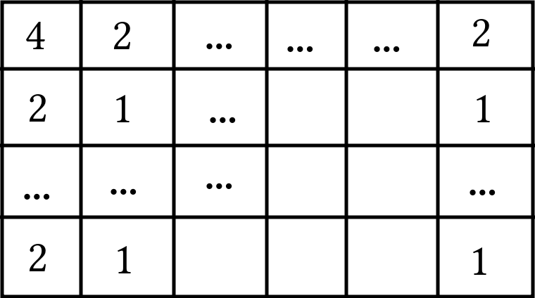

# [Codeforces 1178C - Tiles](https://mirror.codeforces.com/contest/1178/problem/C)

Make a grid and notice the following:

1. The first tile (top left) has 4 possible rotations;
2. The tiles on the top have 2 possible rotations;
3. The tiles on the left have 2 possible rotations;
4. All other tiles have their rotations defined by the previous ones;

The figure below shows the number of available rotations per tile:

Thus, the total number of tilings $P$ is given by:

$$
P = 4 \times 2^{w-1} \times 2^{h-1} = 2^{w} \times 2^{h}
$$

Finally, one needs an efficient way of computing $P \% M$:

$$
P \% M = (2^{w} \times 2^{h}) \% M = (2^{w} \% M) \times (2^{h} \% M)
$$

And:

$$
2^y \% M = \begin{cases}
1 &,& y = 0 \\
(2^{y/2} \% M)^2 \% M &,& y \text{ even} \\
(2 \times 2^{y-1}) \% M &,& y \text{ odd}
\end{cases}
$$
