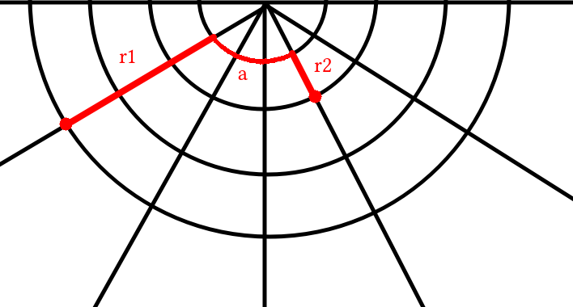

# [Amsterdam Distance](https://open.kattis.com/problems/amsterdamdistance)

Let's say that, in order to arrive at its destination, the friend walks $r_1$ units in the radial direction towards the center, then they walk $a$ units in the angular direction, and finally they walk $r_2$ units in the radial direction towards the outside. What is the total distance $D$ that the friend walks?

$$ D = R \ \dfrac{r_1}{N} + \left(R \ \dfrac{r}{N}\right) \ \left( \pi \ \dfrac{a}{M}\right) + R \ \dfrac{r_2}{N}$$

The first and third part are the radial distances and the middle one is the angular distance. Notice that $r$ is the radial position used in the angular displacement.

To solve the problem, i.e. to find the minimum distance the friend has to travel, one can iterate for $r = 0, \dots, \max(a_y, b_y)$ and check which one yields the minimum distance. For that, one uses: $r_1 = |a_y - r|$, $r_2 = |b_y - r|$, and $a = |a_x - b_x|$.

